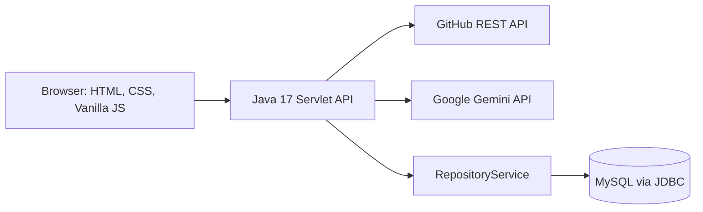

# RepoInsight AI

> AI-powered GitHub repository intelligence built with Java 17, Servlets, MySQL, GitHub REST API, and Google Gemini.

RepoInsight AI turns a public GitHub repository URL into a concise engineering dashboard. It collects repository metadata and code signals from GitHub, asks Gemini for an evidence-based analysis, and stores reports in MySQL for later review.

## What it does

- Accepts either `owner/repository` or a full public GitHub repository URL.
- Collects repository metadata, description, stars, forks, watchers, issues, languages, topics, README, file structure, and recent commits.
- Generates AI-powered project summary, architecture notes, technology insights, and improvement recommendations.
- Displays a clean tabbed dashboard for technology, architecture, recommendations, README, and files.
- Saves successful AI reports to MySQL and exposes report history.

## Dashboard preview

The dashboard contains a repository overview, activity counters, AI summary, language breakdown, technology tags, and interactive analysis tabs.

```text
GitHub URL → Java Servlet → GitHub REST API → Gemini API → MySQL
     ↑                                                     ↓
     └──────────── Responsive Vanilla JavaScript UI ──────┘
```

## Architecture



## Technology stack

| Layer | Technology |
| --- | --- |
| Frontend | HTML5, CSS3, Vanilla JavaScript |
| Backend | Core Java 17, Jakarta Servlets, Java HTTP Client |
| Data access | JDBC, MySQL 8, prepared statements |
| AI and APIs | Google Gemini API, GitHub REST API |
| Build and deployment | Maven, Docker, Docker Compose, GitHub Actions |

## Project structure

```text
src/main/java/com/repointel/
├── controller/     # HTTP servlet endpoints
├── model/          # Repository and report data models
├── service/        # GitHub, Gemini, JDBC, and report services
└── util/           # Configuration and JSON helpers
src/main/webapp/    # Dashboard HTML, CSS, and JavaScript
db/init.sql         # MySQL tables and relationships
.github/workflows/  # Docker startup verification workflow
Dockerfile          # Tomcat deployment image
docker-compose.yml  # Application and MySQL services
```

## API endpoints

| Method | Endpoint | Description |
| --- | --- | --- |
| `POST` | `/api/repositories/analyze` | Fetches GitHub data for `{ "repositoryUrl": "owner/repository" }` |
| `POST` | `/api/insights/generate` | Gets Gemini insights and saves the analysis report |
| `GET` | `/api/reports/` | Lists saved reports |
| `GET` | `/api/reports/{id}` | Retrieves one saved report |

## Run with Docker

### 1. Configure keys

Copy `.env.example` to `.env` and set your values:

```dotenv
GEMINI_API_KEY=your_google_gemini_api_key
GITHUB_TOKEN=optional_github_personal_access_token
DB_PASSWORD=repo_password
MYSQL_ROOT_PASSWORD=change_this_for_production
```

`GEMINI_API_KEY` is required to generate AI analysis. `GITHUB_TOKEN` is optional but recommended because it increases GitHub API rate limits.

### 2. Start the application

```bash
docker compose up --build
```

Open `http://localhost:8080` and try:

```text
https://github.com/octocat/Hello-World
```

Docker Compose starts Tomcat with the application and a MySQL 8 database. The database uses the `mysql_data` named volume, so saved reports survive container restarts.

## Verify from GitHub

This repository includes an automated GitHub Actions workflow, **Verify RepoInsight AI**. Every push to `main`:

1. Builds the Docker image.
2. Starts MySQL and the Java application with Docker Compose.
3. Waits for the application to respond on port 8080.
4. Stops the test containers.

Open the repository's **Actions** tab after uploading the project. A green check confirms that the Dockerized application successfully builds and starts. The workflow uses a fake Gemini key; it does not perform a paid AI request or expose your real secret.

### Verify the real AI integration without installing Docker

1. In the GitHub repository, open **Settings** → **Secrets and variables** → **Actions**.
2. Click **New repository secret**.
3. Name it `GEMINI_API_KEY` and paste your key. GitHub encrypts it and does not show it again.
4. Open the **Actions** tab → **Verify RepoInsight AI** → **Run workflow** → **Run workflow**.

This manual run starts Docker on GitHub's hosted runner, analyzes `octocat/Hello-World`, calls Gemini, saves the report to MySQL, and checks that a summary was returned. Your computer does not download or run Docker. The key is not printed in logs or committed to the repository.

## Database schema

The MySQL schema is initialized from `db/init.sql`.

- `users` — optional ownership information for future authentication.
- `repositories` — GitHub URL, language data, stars, forks, and analysis time.
- `analysis_reports` — Gemini summary, architecture notes, recommendations, and generation time.

The application uses JDBC prepared statements and a transaction when saving a repository/report pair.

## Security notes

- Never commit `.env`, API keys, passwords, or access tokens.
- Keep `GEMINI_API_KEY` in encrypted host or GitHub secrets for deployed environments.
- Use a GitHub token with only the permissions you need.
- This application analyzes public repositories only.

## Current verification status

- Frontend JavaScript syntax has been checked.
- The GitHub Actions workflow verifies Docker build and application startup after upload.
- A full AI result requires a valid `GEMINI_API_KEY` at runtime; test it by analyzing a public repository after deployment.

